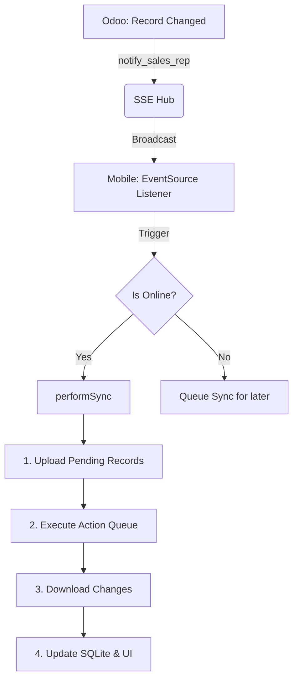
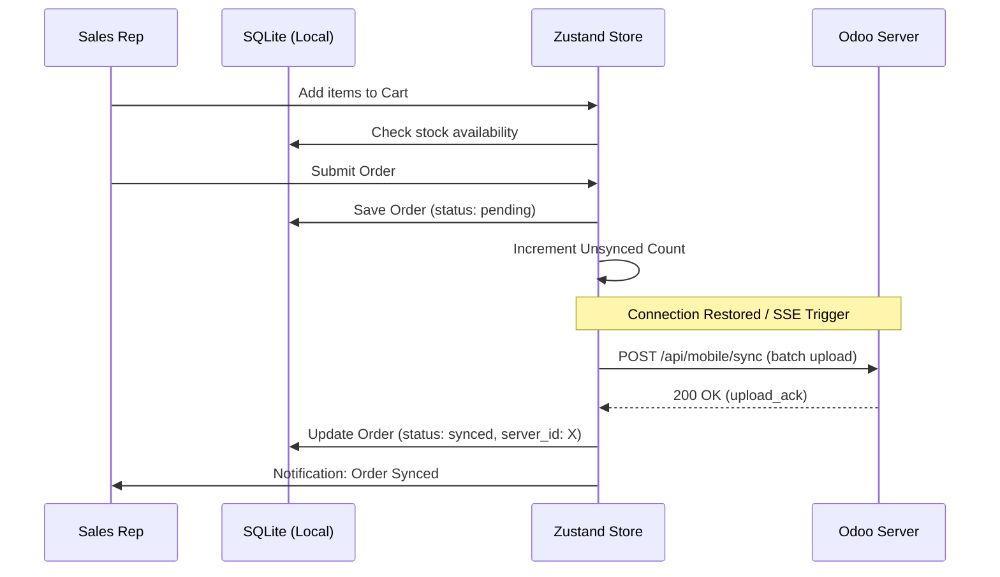
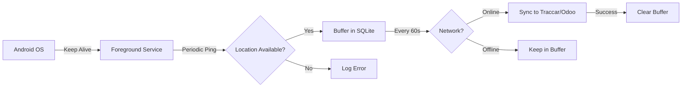
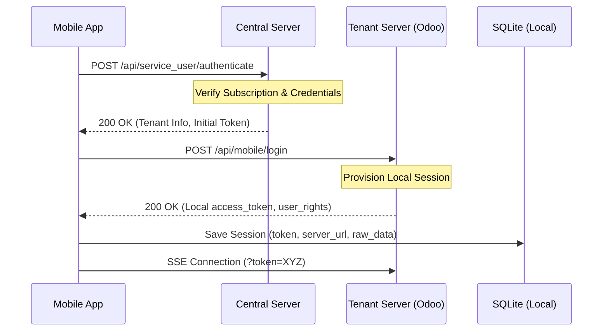
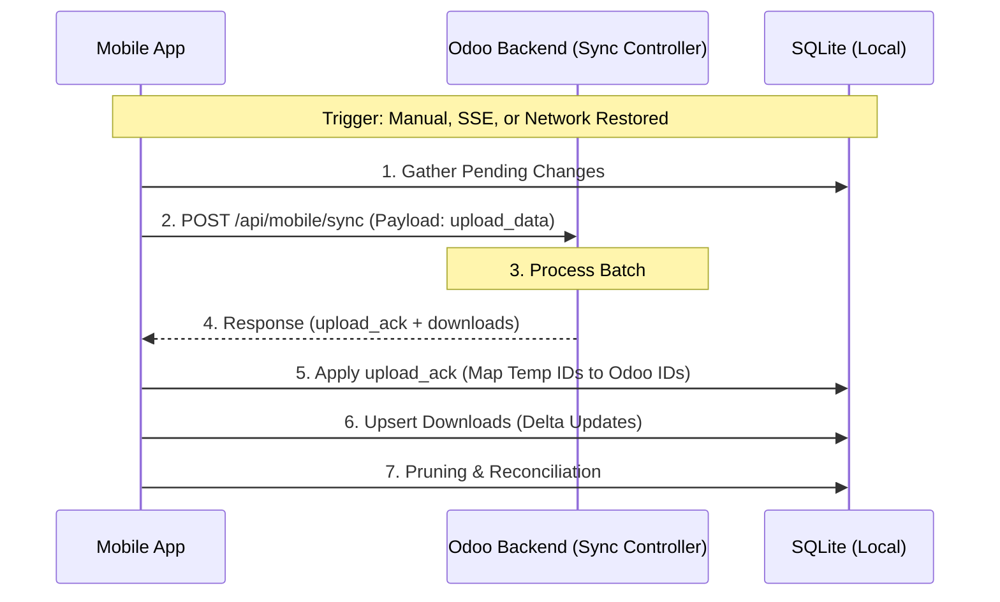

# Pomo Track Mobile Application - Technical Documentation

## 1. Overview

Pomo Track (formerly Trackly) is a high-performance, cross-platform mobile application designed for sales representatives. Built with **Expo (React Native)**, it features an offline-first architecture, real-time synchronization via **Server-Sent Events (SSE)**, and deep integration with **Odoo 18** and **Traccar GPS**.

---

## 2. Architecture & Tech Stack

### Frontend (Mobile)
- **Framework**: Expo SDK 54 (React Native).
- **State Management**: **Zustand** with persistent middleware for auth and configuration.
- **Local Persistence**: `expo-sqlite` using a Repository Pattern for clean data access.
- **Networking**: 
  - **Axios**: Standard JSON-RPC 2.0 and REST calls.
  - **EventSource (SSE)**: Persistent connection for real-time server-to-client triggers.
- **UI Framework**: React Native Paper (Material Design 3) with custom high-fidelity components.

### Backend (Odoo Integration)

- **Custom Addons**: `sales_rep_management` and `traccar_integration`.

- **API Strategy**: Hybrid approach using both standard Odoo RPC and custom Controllers for performance and CORS control.
- **Real-time Engine**: Python-based SSE hub for broadcasting database changes to connected devices.

---

## 3. Synchronization Engine (Deep Dive)

### Sync Lifecycle Flow

This diagram shows how a change in Odoo triggers an update on the mobile device in real-time.

### Manual CORS Handling

To ensure compatibility across Web and Mobile, custom Odoo controllers implement a manual CORS strategy:

- **Preflight (OPTIONS)**: Handles browser preflight checks by returning explicit `Access-Control-Allow-*` headers.
- **Response Injection**: All manual responses use a helper `_make_cors_response` to inject `Access-Token` and `X-Requested-With` into allowed headers.

---

## 4. Sales & Inventory Workflow

### Offline Order Processing

Representatives can work entirely offline. Orders are buffered locally and reconciled when connectivity returns.

### Unit of Measure (UoM) Handling

- **Factor Calculation**: Supports both "Smaller than Category Reference" and "Bigger than Category Reference".
- **Stock Validation**: Validates `free_qty` in real-time. The UI restricts ordering beyond physical stock.

---

## 5. Location Tracking Pipeline (Traccar)

Designed for 100% reliability on Android 14+ using Foreground Services.

### Accuracy & Hardware

The pipeline relies exclusively on **GPS (Global Positioning System)** rather than IP-based geolocation. This ensures high-fidelity tracking suitable for sales route auditing.

- **High Precision**: Configured with `Accuracy.High` (GPS only) to capture precise coordinates, speed, and heading.
- **Automotive Optimization**: Uses `AutomotiveNavigation` activity type to prioritize GPS satellite locks over Wi-Fi/Cell-tower triangulation.
- **Hardware Integration**: Directly accesses device sensors for `speed` (in knots), `bearing` (direction), and `altitude`.

---

## 6. Database & Repository Pattern

The app uses a strict Repository Pattern in `services/database/repositories` to separate SQL logic from UI components.

| Layer | Responsibility |
| :--- | :--- |
| **Component** | Calls `useOfflineStore` or `useCartStore`. |
| **Store** | Orchestrates logic and calls Repositories. |
| **Repository** | Executes Raw SQL queries (Select, Insert, Upsert). |
| **Database** | `expo-sqlite` instance management. |

### Data Pruning
On every successful sync, the app performs "Pruning":
1. Identifies records in SQLite that are no longer assigned to the user in Odoo.
2. Safely deletes them to save space and ensure data integrity.

---

## 7. Security & Deployment

### Authentication

1. **Login**: Handshake with `/api/service_user/authenticate`.
2. **Provisioning**: Receives `access_token` and `session_id`.
3. **SSE Auth**: The token is passed as a query parameter `?token=XYZ` to the SSE endpoint.

### EAS Build Pipeline
- **Profile: Production**: Optimized Hermès JS engine, ProGuard enabled, and production SSL certificates.
- **Permissions**:
  - `FOREGROUND_SERVICE`: Essential for tracking.
  - `POST_NOTIFICATIONS`: For sync and tracking status.
  - `ACCESS_BACKGROUND_LOCATION`: Required for Android 11+ tracking.

---

## 8. Authentication Cycle

The authentication process ensures secure access to both the central service and individual tenant databases. It employs a multi-stage handshake and persistent session management.

### Stage 1: Central Handshake
The app first communicates with the **Global Auth Server** at the address defined in `EXPO_PUBLIC_BASE_URL`. This step:
- Validates the user's email/password against the global user directory.
- Checks if the user's **subscription** is active (`subscription_valid: true`).
- Returns the specific **Tenant URL** (Regional Odoo instance) for that user.

### Stage 2: Tenant Provisioning
Once the tenant URL is identified, the app performs a secondary login directly against the **Tenant Server**:
- Negotiates a local `access_token` for JSON-RPC operations.
- Downloads the user's **Access Rights** (e.g., `access_sales_report`, `access_confirm_quotation`).
- Retrieves **Traccar Configuration** if location tracking is enabled for the account.

### Stage 3: Local Persistence & Recovery
- **Storage**: Sessions are stored in SQLite via `setSession` for persistence across app restarts.
- **Auto-Login**: On launch, `checkSession` restores the `useAuthStore` state. If the token is missing or expired, the user is redirected to the login screen.
- **SSE Tokenization**: Every Server-Sent Event (SSE) connection requires the `access_token` to be passed as a query parameter for authentication on the SSE hub.

---

## 9. Data Sync Cycle

The Data Sync Cycle is the "Heartbeat" of the application, ensuring that the local SQLite database remains a consistent, offline-capable mirror of the Odoo backend.

### Phase 1: The Upload Batch
Before any data is downloaded, the app pushes its local "source of truth" to the server. This includes:
- **Visits & Collections**: Detailed logs of customer interactions.
- **Sales Orders**: Full order objects created while offline.
- **Action Queue**: Commands like `Confirm Order`, `Deliver`, or `Create Customer`.
- **Telemetry**: GPS coordinates buffered from the tracking service.

### Phase 2: Server-Side Execution & Ack
The Odoo `sync_controller` processes the upload in a single transaction where possible:
- **ID Mapping**: The server generates permanent database IDs for every local temporary ID provided.
- **Action Execution**: The server attempts to run queued actions (e.g., validating an invoice).
- **Acknowledgment**: The server returns an `upload_ack` object containing the mapping (e.g., `local_order_id: 123 -> odoo_id: 4567`).

### Phase 3: The Download Delta
The server identifies all changes that have occurred since the app's `last_sync_date`:
- **Master Data**: Updated products, prices, and taxes.
- **Route Changes**: New customers added to the user's route or changes in visit priority.
- **Financial Status**: Updated customer balances and historical payments.

### Phase 4: Reconciliation & Pruning
The final stage of the cycle performs database maintenance to ensure long-term performance:
1. **Reference Update**: Updates all local foreign keys (e.g., changing a `pending_order.partner_id` from a temp ID to a permanent Odoo ID).
2. **Pruning**: Identifies records in SQLite (like old routes or inactive products) that were not present in the latest download and deletes them.
3. **Log Finalization**: Records the `server_time` as the new `last_sync_date` for the next cycle.

---

## 10. Logout & Session Termination

The system implements a strict logout policy to prevent data loss and ensure that field activity is synchronized before a representative leaves the session.

### 10.1 Safe Logout (Validation)
When a user initiates a manual logout:
1. **Unsynced Check**: The app queries the `pending_action` and `sales_order` tables for any records with `is_synced = 0`.
2. **Blocking**: If unsynced data exists, the logout is **blocked** with a warning: *"Cannot logout: X item(s) not yet synced."*
3. **Requirement**: The user must find a connection and perform a successful sync before they are permitted to log out.

### 10.2 Force Logout & Expiration
A "Force Logout" bypasses the validation check and is triggered by:
- **Subscription Expiration**: Detected during a sync or login attempt.
- **401 Unauthorized**: If the `access_token` is revoked on the Odoo side.
- **Remote Revocation**: Triggered by the System Administrator via the Central Server.

### 10.3 Cleanup Cycle
Upon a successful or forced logout, the `clearSession(true)` routine executes:
1. **SQLite Wipe**: Clears all business tables (Orders, Visits, Products, Partners) to prevent cross-account data contamination.
2. **Token Purge**: Deletes the session record containing the `access_token` and `server_url`.
3. **Store Reset**: Re-initializes all Zustand stores to their default loading states.

---

## 11. Storage Architecture

Pomo Track uses a dual-layer storage strategy to balance performance with complex relational data needs.

### 11.1 Key-Value Storage (AsyncStorage)
Used for lightweight, non-relational persistence:
- **Flags**: `isInitialSyncComplete`, `hasAcceptedPermissions`.
- **Metadata**: Last logged-in email (for pre-filling), application versioning.
- **Debug Logs**: Temporary storage for capture-logs before they are sent to the server.

### 11.2 Relational Storage (SQLite)
The primary engine for the offline-first experience, powered by `expo-sqlite`.

| Feature | Implementation |
| :--- | :--- |
| **Engine** | SQLite in **WAL (Write-Ahead Logging)** mode for high-concurrency during sync. |
| **Schema** | Managed via a migration-aware `initDB` routine with `PRAGMA` optimizations. |
| **Performance** | Uses a **Proxy-based Sanitizer** to automatically handle `undefined` values and prevent SQL bridge crashes. |
| **Session Table** | A dedicated table stores the `access_token`, `server_url`, and the raw user JSON for instant recovery on app launch. |
